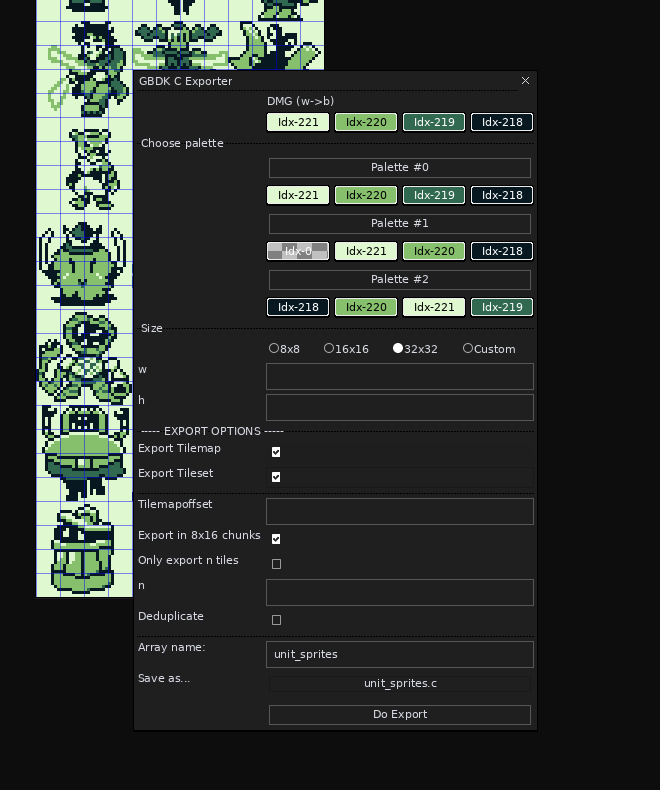

# About

Aseprite utility script to export Images to GBDK C arrays with an export dialog. Only tested on Linux, but should probably run everywhere.

Features:

    - supports subdividing the image in e.g 32x32 sprites (e.g for monster sprites for an RPG)
    - optional tileset and tilemap generation for subdivided images (needs src/tile_ex.h)
    - tile map generation with optional tile offset
    - optional simple tile deduplication within sprite limits
    - no GBC support yet
    - no metasprite support

It uses indexed palettes and probably won't work out of the box unless your DMG palette contains these shades of green: "#e0f8cf","#86c06c","#306850","#071821" (the same are used by GB Studio)
But the colors can easily be configured in the script itself.
For tileset / map drawing a GB Studio compatible implementation is in src/tile_ex_gbs.c

Known Issues:
    
    - changing array name after selecting filename creates a buggy filename
    

Future TODOs:

    - GBC color support
    - metasprite
    - plain gbdk implementation for tile_ex.h

This script was created based on [gbdk-sprite-exporter](https://github.com/AlanFromJapan/gbdk-sprite-exporter)

